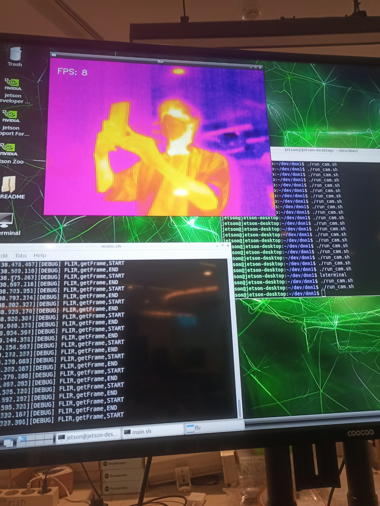
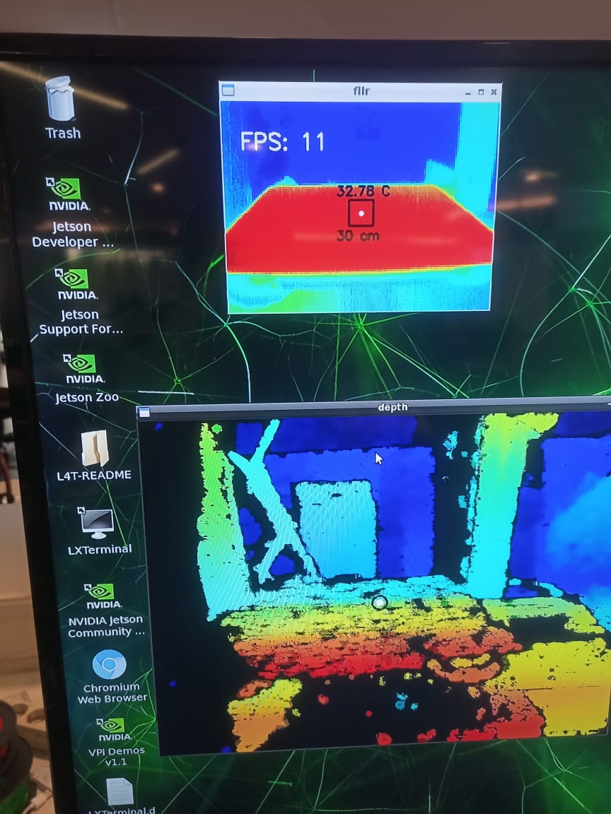
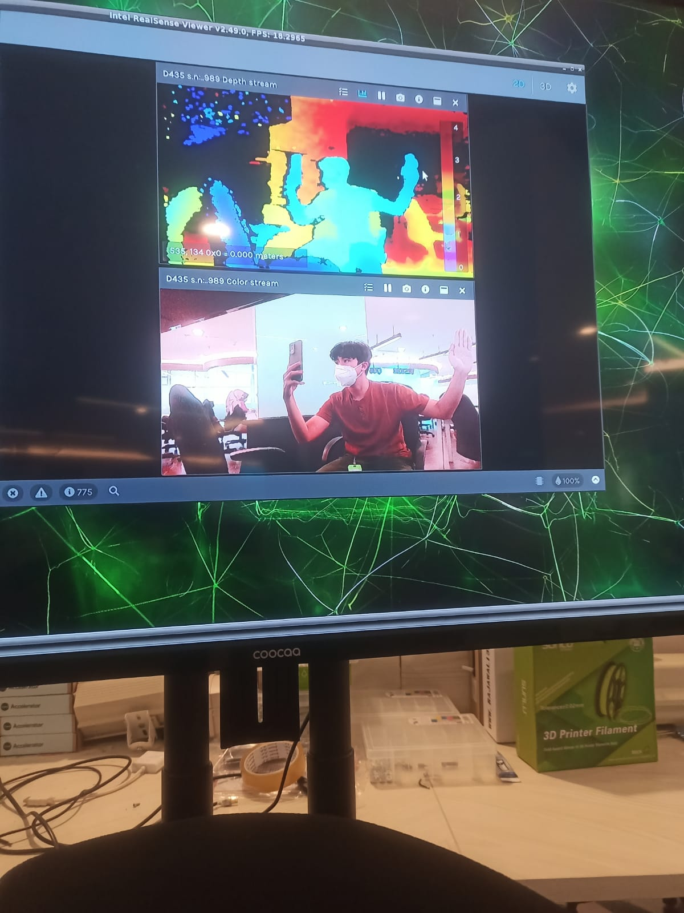

## Welcome

## Research Journals
- https://docs.google.com/document/d/1wTaqokRTCPI-C6tkusbhQnFXuTEDnBpD9FGaUGyI0M0/edit?pli=1

## Prerequisites
- Ubuntu 20.04
- CUDA 11.5
- CuDNN 8.3
- OpenCV 4.4.0 CUDA
- GCC 7

## How To Setup Prerequisites Fresh
- check `how-to-setup.txt` or `initialSetup.sh`

## How to Compile
- `sudo chmod a+x compile_cam.sh`
- when ready, execute `./compile_cam.sh`

## How to run
- `./visioncam` -h to view help

## Help
```
Usage: visioncam -mode [mode] [options] ...
Options:
  -mode [mode]    Select mode:
                    0: vision cam
                    1: center scan
                    2: min-max temp scan
  --log           Enable log
  -l [level]      Set log level:
                    0: INFO
                    1: LOG
                    2: DEBUG
                    3: ERROR
                    4: CRITICAL
  -h --help       Show Vision Cam Help

VisionCam Only Options:
  -d              Enable depth frame (for operation 6)
  -t              Enable thermal frame (for operation 6)
  -mode 0 -vc [opnum] Select VisionCam Operation:
                    0: Draw
                    1: Draw + Depth
                    2: Draw + Depth + Depth Window
                    3: Draw + Track + Temp
                    4: Draw + Track + Temp + Depth
                    5: Draw + Track + Temp + Depth + Thermal Window
                    6: (default) All Features + Show All Windows
```
## FLIR TEST


## RealSense-FLIR Center Adjusting


## FRAME CALIBRATION
